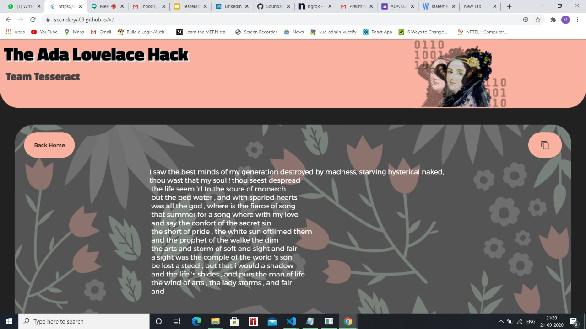

# Sonnet generation through AI
View it at : [click here](https://soundarya03.github.io/#/)

This is a project that seeks to celebrate Ada Lovelace by bringing together two wildly different domains that moulded Ada's life - computer programs and poetry. And so, generating sonnets through AI. This is also our submission for the IEEE Ada Lovelace Hack, September 2020. 
The project consists of two major parts.
1. An ML model that can generate sonnets based on some input by the user (henceforth referred to as 'seed text').
2. A simple, intuitive webpage that serves as an interface between the AI and the user.

## Tech Stack Used

1. Flutter for the Web
2. Flask
3. Python version 3.7.3
4. TensorFlow , matplotlib 

## Installation

The webpage has been built using Flutter, and so to view it, you need to install it.
To run the backend flask rest api on your local systems follow the following steps:
1. clone the github repo
2. Do pip install -r requirements.txt
3. python app1.py

your server will be started on port 5000

### Requirements
1. Flutter
2. Dart
3. Text editor to view the code ( VSCode/Android Studio/Atom, etc. is preferred, though you can view it even with simple applications like Notepad. )
4. Python (version : 3.7.3 preferred)

### Installation process
 The process has two main parts.

- Part 1 : Installing Flutter and Dart.

https://flutter.dev/docs/get-started/install

If this seems too confusing, or hard to follow, you can refer the following video -
https://www.youtube.com/watch?v=1ukSR1GRtMU - from 06:02 to 10:26.
This explains flutter and it's installation step by step, in great detail, and will make sure you have absolutely no trouble.

*Note: Android Studio is not a necessity, because this project uses Flutter to build a webpage, not a mobile app. *

- Part 2 : Enabling Flutter for the web.

Once you have installed Flutter and Dart successfully, run the following commands on the command prompt.
  - flutter channel master
  - flutter upgrade (to ensure you are on the latest version)
  - flutter doctor (to check if everything is fine)
  - flutter config --enable-web
  
  Again, in case of any problems, you may refer this video: https://www.youtube.com/watch?v=33kyEzDMTZU&t=44s from 00:00 to 01:00
  
 You are now good to go! 
 
## Viewing the webpage

- In the terminal, enter the following command : 
  - flutter run -
This will open up the webpage on the browser.

## Using the webpage

The webpage has been made to be both intuitive and responsive, which means it is very simple to use and can even be viewed on different devices with different aspect ratios.
Still, here we attach a small step-by-step use-case:-
- Enter some seed-text in the text entry field in the middle of the page.
- You will see that you cannot generate a sonnet without any seed-text.
- After entering text, click on 'Generate Sonnet!'.
- You will now be shown the sonnet written by our ML model.
- Click on the copy button at the top right. This way, you can easily copy the entire sonnet at the click of a button. 
- To go back home, simply click on Back Home on the top left.

## Who are we?

We are Team Tesseract, a group of undergraduates from Ramaiah Institute of Technology, Bengaluru, and active members of IEEE. 

Team members: 
- Muskan Gupta (5th sem)
- Soundarya Rangarajan (3rd sem)
- Manvendra Bansal (5th sem)
- Prateek Pandey (5th sem)

Mentor:  Dr. Annapurna P. Patil

## Attributions and assets

- Binary Icon from Flaticon.com (https://www.flaticon.com/free-icon/binary_1822940?term=binary&page=1&position=3)
- Ada lovelace picture from https://www.biography.com/scholar/ada-lovelace
- The Ada Lovelace graphic has been developed by our team itself, from the above assets.
- Graphic tool : Canva, https://www.canva.com/

## Important Links

- For Presentation Link : [click here](https://docs.google.com/presentation/d/18va9S7_D4KlYw5RN6RAyV2DuMSJcuiwQdJEI9H09wOs/edit?usp=drivesdk)
- Explanation Video Link : [click here](https://drive.google.com/file/d/1NlL0UiKMCblmAvWD4AQolPgWiUrnGzrV/view?usp=drivesdk)
- App Demo Link : [click here](https://megabyte98.github.io/)

## UI Of the Application

